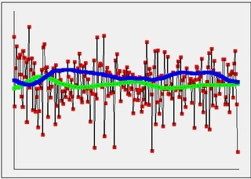
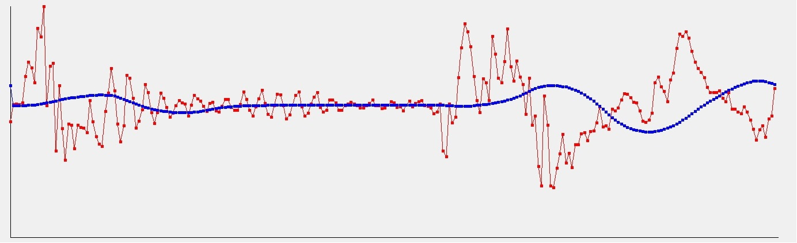
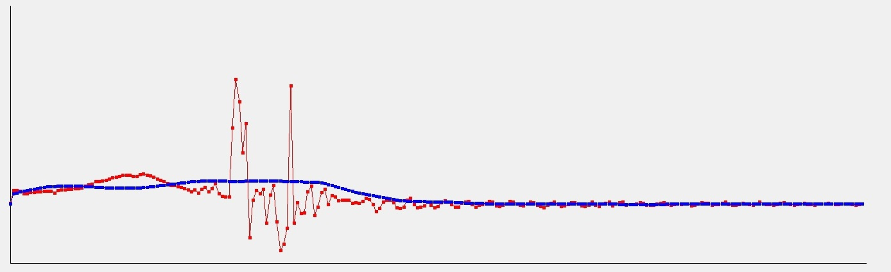
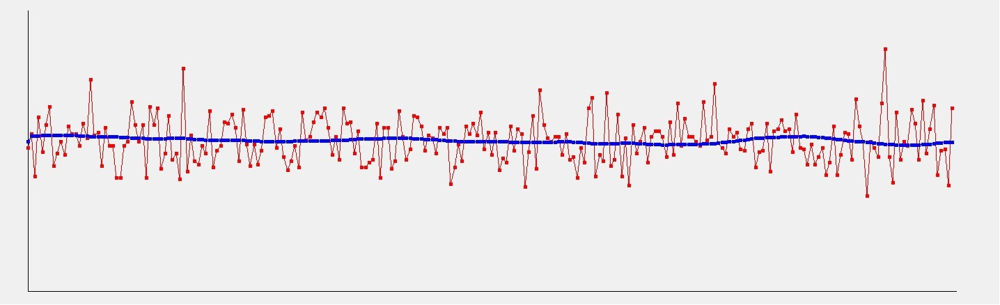
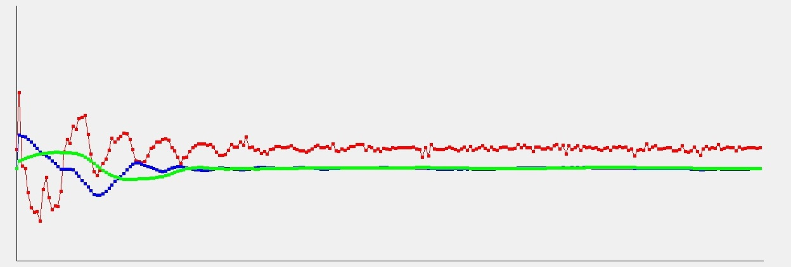
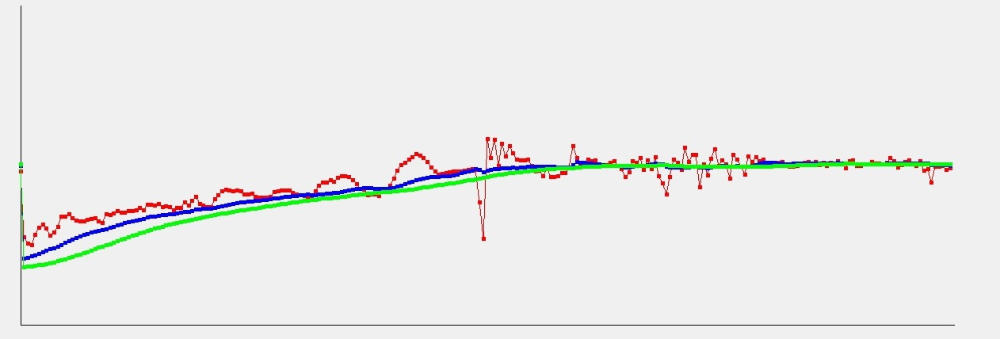

# MPU6050

MPU6050 is a module with 3-axis accelerometer and 3-axis gyroscope. 

## Start

To start use MPU6050 with I2C call:
```
  int MPU6050::open(const char *name, DI2C::DI2CRegister address);
  int MPU6050::init();
```
Where `name` is device name and (for example: `"/dev/i2c-0"`) and `address` is MPU6050 I2C address (use `MPU6050_DEFAULT_ADDRESS`).

## Read MPU6050 registers:

Use one of this six function to read need value:
```
    void readGyroX();
    void readGyroY();
    void readGyroZ();

    void readAccelX();
    void readAccelY();
    void readAccelZ();
```
Or read 3 values for gyro or accel:
```
  void readGyro();
  void readAccel();
```
Or read all:
```
  void readAll();
```

## Get usable values:

Get all data to structure MPU6050Data:
```
  struct MPU6050Data {
      MPUUnit gx;
      MPUUnit gy;
      MPUUnit gz;

      MPUUnit ax;
      MPUUnit ay;
      MPUUnit az;
  };
    const MPU6050Data& getData() const {return data;}
```
Or to C-style array:
```
  int16_t* getLineData();
```
Or get 16 bit value:
```
    int16_t GX() const;
    int16_t GY() const;
    int16_t GZ() const;

    int16_t AX() const;
    int16_t AY() const;
    int16_t AZ() const;
```

## Filter data stream

To filter gyro and accel values (vibrations, default error, electic-scheme noise, temperature noise) I use my simple project/library DBalance.

Filtering examples:











